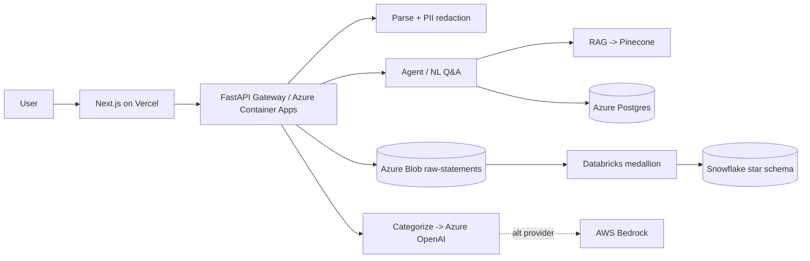

# FinSight — Personal Finance Statement Analyzer & Anomaly Monitor

Upload a bank/credit-card statement → FinSight parses it, redacts PII, categorizes every
transaction, flags anomalies, and lets you ask natural-language questions about your money.
It's a multi-cloud, interview-grade reference build (Azure + AWS + Snowflake + Databricks +
Pinecone), engineered to run on free tiers and student credits.

> Status: **Phase 0–1 (local foundation)**. The upload → parse → PII-redact → categorize
> pipeline runs locally with **no cloud accounts required**. Cloud phases are layered in next.

## Architecture (target)



## Quickstart (local, no cloud)

Prereqs: Python 3.11+, [uv](https://docs.astral.sh/uv/), and Docker (optional, for the local stack).

```bash
# 1. Install dependencies (core + parsing + dev tooling)
uv sync --extra dev --extra data

# 2. Generate synthetic statements (no Kaggle/cloud needed)
uv run python scripts/generate_synthetic_statements.py --count 5

# 3. Run the tests
uv run pytest

# 4. Start the API
uv run uvicorn services.gateway.app:app --reload --port 8000
# → POST a statement:
#   curl -F "file=@data/synthetic/statement_01.csv" http://localhost:8000/api/statements/parse

# 5. Run the frontend (separate terminal)
cd frontend && npm install && npm run dev   # http://localhost:3000
```

Optional local infra (Postgres + Azurite blob emulator + Redpanda/Kafka):

```bash
docker compose up -d
```

## Repository layout

| Path | What |
| --- | --- |
| `libs/finsight_common/` | Shared lib: settings, models, PII redaction, parsing, categorization, LLM abstraction |
| `services/gateway/` | FastAPI entry point (upload → parse → redact → categorize) |
| `scripts/` | Synthetic data generator, dataset/util scripts |
| `frontend/` | Next.js app (deploys to Vercel) |
| `tests/` | pytest suite |
| `docs/` | Architecture & roadmap |
| `.github/workflows/` | CI (lint + test) |

## Roadmap

MVP (live link first): scaffold → data/parsing/PII → Azure OpenAI categorization → Pinecone RAG
→ deploy to Azure Container Apps + Vercel. Then expand: Databricks medallion, Snowflake star
schema, AWS Bedrock, anomaly ML + MLflow, Kafka, Azure Functions, Terraform, CI/CD, Grafana.

## Security

Secrets come from environment variables locally and **Azure Key Vault** in the cloud — never
committed. PII is redacted from statement text before it can reach any external LLM or vector
store. See `.env.example` for the configuration surface.

## License

MIT — see [LICENSE](LICENSE).

