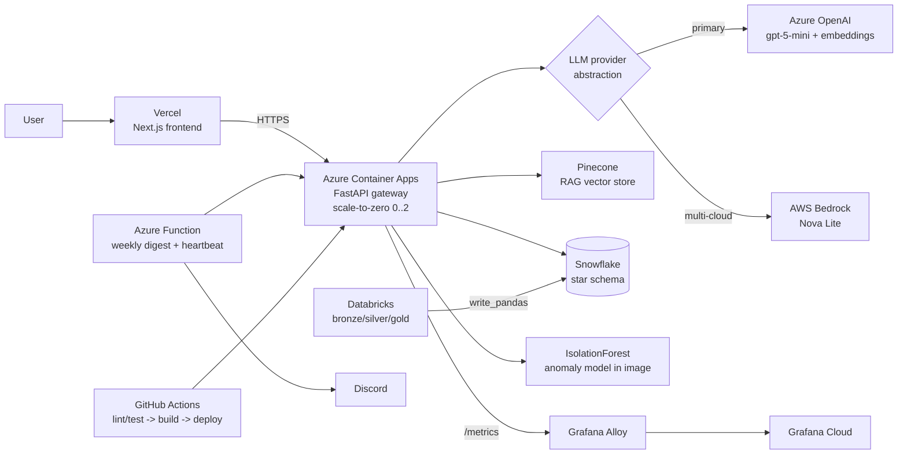

# FinSight — Well-Architected Framework Review

A self-assessment of the live FinSight system against the five Well-Architected
pillars (Azure WAF; AWS WAF pillars map 1:1). Scope is the deployed portfolio
build, with honest gaps and a prioritized remediation backlog. Ratings are
relative to a **cost-constrained, free-tier portfolio**, not an enterprise SLA.

_Last reviewed: 2026-07-06 · Live commit surfaced at `/readyz` (`git_sha`)._

---

## Architecture at a glance

**Stack:** Vercel · Azure Container Apps · Azure OpenAI · AWS Bedrock · Pinecone ·
Snowflake · Databricks · scikit-learn + MLflow · Prometheus + Grafana Cloud ·
Azure Functions · GitHub Actions CI/CD · Azure Key Vault.

---

## 1. Reliability

**Rating: 🟢 Good (single-region by design)**

**Strengths**
- Health/readiness probes (`/healthz`, `/readyz`) drive Container Apps restarts.
- Stateless gateway → safe horizontal scale (0→2); state lives in managed stores.
- **Graceful degradation everywhere**: LLM `NullProvider` fallback, agent
  keyword-router fallback when the model returns bad JSON, optional ML-model load
  (rules still run), in-memory store when Snowflake is absent.
- Managed services (Snowflake, Pinecone, Vercel) own their own HA/backups.
- Idempotent deploy script; CI gates every merge (lint + 77 tests).

**Gaps / risks**
- Single region (Central India); no multi-region failover (out of scope for cost).
- No formal SLOs or health-based alerting; free/trial tiers carry hard limits.
- Databricks batch is manual; the digest Function has no retry/DLQ.
- Scale-to-zero → cold-start latency on the first request.

**Actions:** define SLOs + Grafana alert rules; document RTO/RPO; optionally set
`min-replicas 1` before a demo to avoid cold starts.

---

## 2. Security

**Rating: 🟡 Solid fundamentals, needs API auth + secret rotation**

**Strengths**
- **PII redaction runs before any statement text reaches an LLM, embeddings, or
  Pinecone** (regex redactor: card/Aadhaar/PAN/IFSC/email/phone).
- No secrets in code: Container App secrets + Key Vault; `.env` is gitignored.
- **Least privilege**: GitHub deploy SP is scoped to the resource group (not the
  subscription); AWS Bedrock uses a dedicated IAM user (not root).
- CORS locked to the Vercel origin; non-root container user; HTTPS end-to-end.
- Provider abstraction avoids single-vendor lock-in.

**Gaps / risks**
- 🔴 **Secrets exposed in setup chat must be rotated**: Databricks PAT, the Azure
  SP client secret, and the storage account key.
- 🔴 **The public API has no authentication or rate limiting** — anyone with the
  URL can call it.
- Key Vault exists but runtime reads Container App secrets/`.env`, not KV via
  managed identity.
- Bedrock IAM user has `AmazonBedrockFullAccess` (should scope to `InvokeModel`/
  `Converse`); Unity Catalog column policies not enforced; no dependency scanning.

**Actions (P0/P1):** rotate the three exposed secrets; add an API key/JWT + rate
limiting; wire Key Vault via a Container App managed identity; scope the Bedrock
policy; enable Dependabot + GitHub secret scanning; enforce UC PII policies.

---

## 3. Cost Optimization

**Rating: 🟢 Excellent for the scope**

**Strengths**
- **Scale-to-zero** Container Apps + **Consumption** Functions = pay-per-use.
- Snowflake auto-suspend (60s); demo-mode Kafka/AKS (never left running).
- **MLflow runs locally** (SQLite) — no managed-MLflow cost; model ships in the
  image (2 MB); GHCR instead of paid ACR.
- On-demand **Bedrock Nova Lite** (~₹ negligible per thousands of calls).
- Free/student tiers across the board, deliberately chosen.

**Gaps / risks**
- Azure budget alert not yet configured; AWS budget just created.
- Grafana Alloy scraping the live app keeps it warm (credit burn) if left running.
- Trial clocks (Snowflake, AWS credits, Grafana Pro) need calendar tracking.

**Actions:** set an Azure budget (~₹1,500) with 50/80/100% alerts; run Alloy only
during demo sessions; calendar the trial expiries; keep the `project=finsight`
tag on every resource for cost attribution.

---

## 4. Operational Excellence

**Rating: 🟢 Strong CI/CD; declarative IaC is the main gap**

**Strengths**
- **Full CI/CD, verified end-to-end**: lint + tests → build image (GHCR) →
  auto-deploy to Container Apps (self-gating on the deploy secret).
- **Deploy traceability**: the running commit SHA is surfaced at `/readyz`.
- Idempotent, env-driven deploy scripts; structured JSON logging (structlog).
- Reproducible data + training pipeline; **MLflow experiment tracking**;
  observability via Prometheus + Grafana; 77 tests + ruff in CI.

**Gaps / risks**
- No Terraform yet — infra is provisioned via PowerShell/az, not declarative IaC.
- Deploys go straight to prod (no staging slot); no automated rollback.
- Databricks batch isn't orchestrated (manual notebook run); the Function has no
  Application Insights; no post-deploy smoke test in CI; no failure alerting.

**Actions:** add Terraform (RG, Container Apps, Key Vault, OpenAI, Function);
add a staging revision + automated rollback; orchestrate Databricks (Jobs/ADF);
attach App Insights + alert rules; run `smoke_live.ps1` as a CI post-deploy step.

---

## 5. Performance Efficiency

**Rating: 🟢 Good; cold-start + agent reads are known tradeoffs**

**Strengths**
- Async FastAPI; stateless horizontal scale; **aggregation pushed to Snowflake**.
- Pinecone ANN retrieval; small, fast models (gpt-5-mini / Nova Lite).
- IsolationForest subsamples (256/tree) → fast scoring regardless of data size.
- `/metrics` exposes p95 latency per endpoint; heavy imports are lazy.

**Gaps / risks**
- Cold-start latency on scale-to-zero (first request after idle).
- The agent reads the full store per tool call (N reads/run) — a known deferred
  optimization (snapshot once per run).
- Cross-region Bedrock (`us-east-1`) from Central India adds LLM latency.
- No response caching; `max-replicas 2`.

**Actions:** snapshot the transaction store once per agent run; `min-replicas 1`
for demos; cache analytics responses; accept or co-locate the Bedrock region.

---

## Prioritized remediation backlog

| Priority | Item | Pillar |
|:---:|------|--------|
| **P0** | Rotate exposed secrets (Databricks PAT, Azure SP, storage key) | Security |
| **P0** | Add API authentication + rate limiting on the public gateway | Security |
| **P1** | Azure budget alerts (50/80/100%) | Cost |
| **P1** | Terraform IaC for the Azure footprint | Op-Ex |
| **P1** | Key Vault via managed identity; scope Bedrock IAM to InvokeModel | Security |
| **P1** | SLOs + Grafana alert rules; App Insights on the Function | Reliability/Op-Ex |
| **P2** | Staging revision + automated rollback; CI post-deploy smoke test | Op-Ex |
| **P2** | Orchestrate Databricks (Jobs/ADF); enforce UC PII policies | Op-Ex/Security |
| **P2** | Agent store-snapshot optimization; analytics caching | Performance |

---

## Key design tradeoffs (context)

A cost-constrained, free-tier portfolio deliberately trades enterprise HA for
economy: **scale-to-zero** (cold starts vs. cost), **demo-mode Kafka/AKS**
(spin up on demand), **local MLflow** (no managed cost), **single region**, and
**managed SaaS** (Snowflake/Pinecone/Vercel) to offload HA. The **multi-cloud LLM
abstraction** (Azure OpenAI ⇄ AWS Bedrock, switchable via one env var and
verified live on both) is the headline architectural decision — it demonstrates
portability and avoids vendor lock-in without duplicating application logic.

> _Sustainability (AWS 6th pillar): scale-to-zero and on-demand compute minimize
> idle energy; managed multi-tenant services amortize hardware efficiently._
